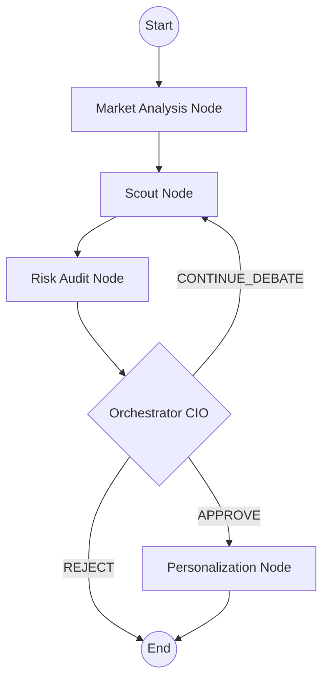

# 🏦 Investment Council: Technical Documentation

## 1. Project Overview
**Investment Council** is an advanced, multi-agent AI investment advisory system. Built using **LangGraph** and **LangChain**, it simulates an institutional investment committee (The Council) where specialized AI agents collaborate, debate, and audit investment strategies for individual users.

The system is designed to be:
- **Autonomous**: Agents use ReAct (Reasoning + Acting) patterns to fetch real-time data using tools.
- **Self-Correcting**: An Orchestrator manages a debate loop between the Scout (idea generator) and the Risk Guardian (auditor).
- **Personalized**: Final allocations are calculated based on the user's specific financial surplus, risk capacity, and liquidity needs.

---

## 2. System Architecture

### 2.1 The Orchestration Graph
The workflow is defined as a stateful directed acyclic graph (with loops) using LangGraph.



### 2.2 Core Technologies
- **Logic**: Python 3.10+
- **Orchestration**: LangGraph
- **Chain of Thought**: LangChain
- **LLM**: Groq (Llama 3 / Mixtral) with Gemini fallbacks
- **State Management**: TypedDict-based graph state
- **Validation**: Pydantic Settings

---

## 3. The Council: Agent Deep Dives

### 🌍 Market Analysis Node (`market_node.py`)
- **Role**: Senior Market Strategist.
- **Goal**: Determine the current "Market Regime" (RISK_ON, RISK_OFF, NEUTRAL).
- **Behavior**: Uses tools like `fetch_market_indicators` (VIX, SMA) and `fetch_sectoral_breadth` to identify if the environment is bullish or bearish.
- **Output**: Sets the market regime which dictates how aggressive the Scout agent can be.

### 🔍 Scout Node (`scout_node.py`)
- **Role**: Equities Scout / Idea Generator.
- **Goal**: Identify 3-5 high-quality Indian stocks (NSE) or assets.
- **Behavior**: Filters the universe based on the market regime and user risk score. It has a **Learning Capability**: if the Orchestrator sends it back for "Debate", it reads the failure reasoning from the previous round to adjust its search (e.g., searching for lower beta stocks).

### 🛡️ Risk Audit Node (`risk_node.py`)
- **Role**: Chief Risk Officer (CRO).
- **Goal**: Audit the Scout's recommendations.
- **Behavior**: Uses tools like `get_comprehensive_risk_metrics` and `run_stress_test`. It compares the proposed assets against the user's specific risk thresholds (Beta, Drawdown, Correlation).

### 🏛️ Orchestrator Node (`orchestrator_debate_node.py`)
- **Role**: Chief Investment Officer (CIO).
- **Goal**: Final decision maker.
- **Logic**: 
    - Analyzes findings from Scout and Risk.
    - Decides whether to approve the portfolio or request a revision (Debate).
    - **Fail-Safe**: If the system reaches `max_debate_iterations` (default: 3) without a safe solution, it triggers **Safe Harbor Mode**, replacing risky picks with pre-vetted safe ETFs to ensure user safety.

### 💰 Personalization Node (`personalization_node.py`)
- **Role**: Certified Financial Planner (CFP).
- **Goal**: Convert approved tickers into specific currency amounts (₹).
- **Behavior**: Calculates the exact monthly investment for each asset by respecting the user's monthly surplus, debt-to-income ratio, and required liquidity reserve.

---

## 4. Data Model: `InvestmentState`
The `InvestmentState` (defined in `src/core/state.py`) is the single source of truth that flows through all nodes.

| Field | Type | Description |
| :--- | :--- | :--- |
| `user_profile` | `UserProfile` | Risk scores, income, debt, and constraints. |
| `market_context`| `MarketContext` | Regime (RISK_ON, etc.), confidence score. |
| `scout_recommendations` | `List[ScoutRecommendation]` | The assets currently being considered. |
| `risk_assessment` | `RiskAssessment` | CRO's verdict and metric breakdown. |
| `final_portfolio` | `List[FinalPortfolioAsset]` | Final allocation with ₹ amounts and reasoning. |
| `iteration` | `int` | Counter for the debate loop. |
| `feedback_for_scout` | `ScoutFeedback` | Detailed instructions for correction during debate. |

---

## 5. Directory Structure

```text
InvestmentCouncil/
├── src/
│   ├── agents/             # The Council members (Nodes)
│   │   ├── market_node.py
│   │   ├── scout_node.py
│   │   ├── risk_node.py
│   │   ├── orchestrator_debate_node.py
│   │   └── personalization_node.py
│   ├── core/               # System foundation
│   │   ├── config.py       # Pydantic settings & thresholds
│   │   ├── llm_client.py   # Groq/Gemini client setup
│   │   └── state.py        # Graph state definition
│   ├── orchestrator/       # Graph assembly
│   │   └── graph.py        # LangGraph Workflow definition
│   ├── utils/              # Real-world tools
│   │   ├── market_data.py  # Indicators API
│   │   ├── scout_tools.py  # Fundamental analysis
│   │   ├── risk_tools.py   # Metrics & Stress tests
│   │   └── personalization_tools.py # Allocators
│   └── api/                # FastAPI Endpoints
├── tests/                  # Unit and Integration tests
├── docs/                   # Documentation
├── .env                    # Secrets and Config
└── requirements.txt        # Dependencies
```

---

## 6. Safety & Robustness Features
1. **Groq Hallucination Filter**: All agent nodes include a filter to ignore "none" tool calls, a common issue with some Llama-3 implementations on Groq.
2. **Deterministic Fallbacks**: If an LLM fails to converge or produce valid JSON, every node has a hardcoded backup logic (e.g., equal-weight allocation or safe ETF picks).
3. **Threshold Enforcement**: Risk limits are not just "suggestions"; the `orchestrator_utils.py` contains automated audit logic that checks for hard violations regardless of the LLM's interpretation.
4. **Rate Limit Defense**: Includes automatic pacing (`asyncio.sleep`) to respect provider rate limits (e.g., Groq's high-speed but limited tiers).

---

## 7. Configuration & Thresholds
System behavior is controlled via `.env` or `src/core/config.py`:
- `MAX_DEBATE_ITERATIONS`: Limits the revision loop.
- `VIX_UPPER_LIMIT`: Defines the transition to RISK_OFF (Default: 22.0).
- `MAX_HIGH_RISK_ALLOC`: Caps exposure for conservative/moderate users.
- `DEFAULT_LIQUIDITY_PCT`: Reserves cash for emergencies.
